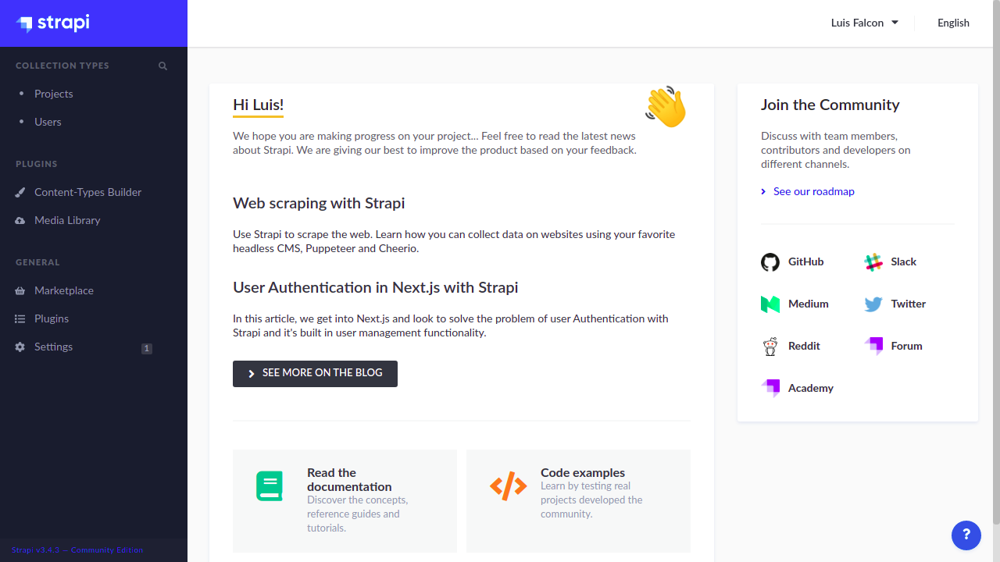

<h1 align="center">Strapi</h1>

<h3 align="center">A strapi project with support for Mongo DB Atlas, Docker, Docker Compose and AWS S3 Bucket.
</h3>

<br>

<p align="center">
  
  
  <a href="https://hub.docker.com/r/luisfalconmx/strapi">
    
  </a>
  
</p>

<br>

<p align="center">
  
</p>

<br><br>

## Getting Started

The image in this project uses strapi in its base to function. It is complemented by a self-administered database in mongodb atlas. You can view the requirements in this document to obtain the credentials of the environment variables.

<br>

### Run the project with the Dockerhub Image

```
docker run --name strapi -p 1337:1337 \
-e DATABASE_HOST= \
-e DATABASE_SRV=true \
-e DATABASE_NAME= \
-e DATABASE_USERNAME= \
-e DATABASE_PASSWORD= \
-e DATABASE_SSL=true \
-e ADMIN_JWT_SECRET= \
-e AWS_ACCESS_KEY_ID= \
-e AWS_ACCESS_SECRET= \
-e AWS_REGION= \
-e AWS_BUCKET= \
luisfalconmx/strapi:latest
```

<br>

### Run the project with the image from Github Package Registry

```
docker run --name strapi -p 1337:1337 \
-e DATABASE_HOST= \
-e DATABASE_SRV=true \
-e DATABASE_NAME= \
-e DATABASE_USERNAME= \
-e DATABASE_PASSWORD= \
-e DATABASE_SSL=true \
-e ADMIN_JWT_SECRET= \
-e AWS_ACCESS_KEY_ID= \
-e AWS_ACCESS_SECRET= \
-e AWS_REGION= \
-e AWS_BUCKET= \
ghcr.io/luisfalconmx/strapi:latest
```

<br>

### Run the project with Docker Compose

```yml
version: '3'
services:
  strapi:
    image: luisfalconmx/strapi:latest
    command: npm run develop
    env_file:
      - .env
    volumes:
      - .:/srv/app
      - node_modules
    ports:
      - '1337:1337'
    depends_on:
      - mongo

  mongo:
    image: mongo:4.2.11-bionic
    environment:
      MONGO_INITDB_DATABASE: strapi
      MONGO_INITDB_ROOT_USERNAME: strapi
      MONGO_INITDB_ROOT_PASSWORD: strapi
    volumes:
      - ./.tmp/data:/data/db
```

Create a `.env` file in current directory and pass value to `ADMIN_JWT_SECRET` variable.

```
NODE_ENV=development
DATABASE_CLIENT=mongo
DATABASE_NAME=strapi
DATABASE_HOST=mongo
DATABASE_PORT=27017
DATABASE_USERNAME=strapi
DATABASE_PASSWORD=strapi
ADMIN_JWT_SECRET=
```

Now run `docker-compose up`

<br>

## Requeriments

In order to use the image of this project, the following requirements need to be met.

- [Docker installed on your computer or on your server](https://docs.docker.com/engine/install/)
- [Docker compose installed on your computer](https://docs.docker.com/compose/install/)
- [An account on MongoDB Atlas](https://www.mongodb.com/cloud/atlas)
- [An account on AWS](https://aws.amazon.com/)

<br>

## Guides

- [Get MongoDB Atlas Credentials]()
- [Get AWS S3 credentials]()
- [Initialize a strapi project]()
- [Configure Environment Variables]()
- [Configure Docker and Docker Compose]()

<br>

## Changelog

All notable changes to this project will be documented in this file.

The format is based on Keep a Changelog, and this project adheres to Semantic Versioning.

[CHANGELOG.md]()

<br>

## License and Code of Conduct

- [MIT License]()
- [Code of Conduct]()
