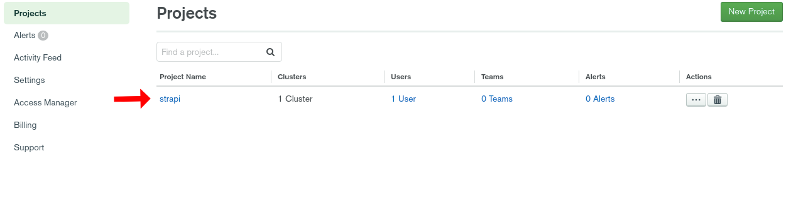
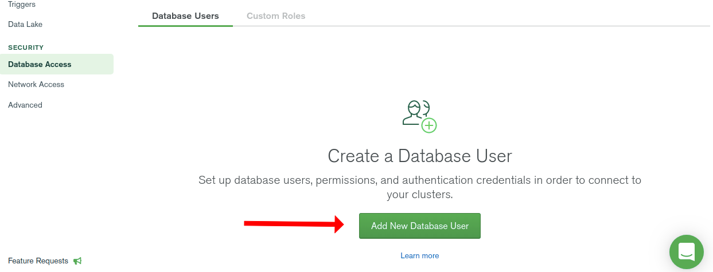
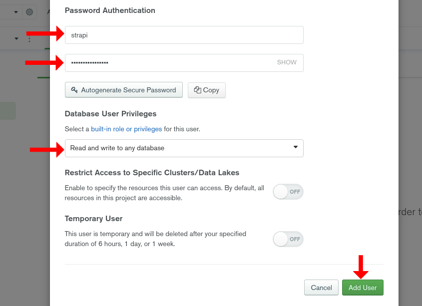
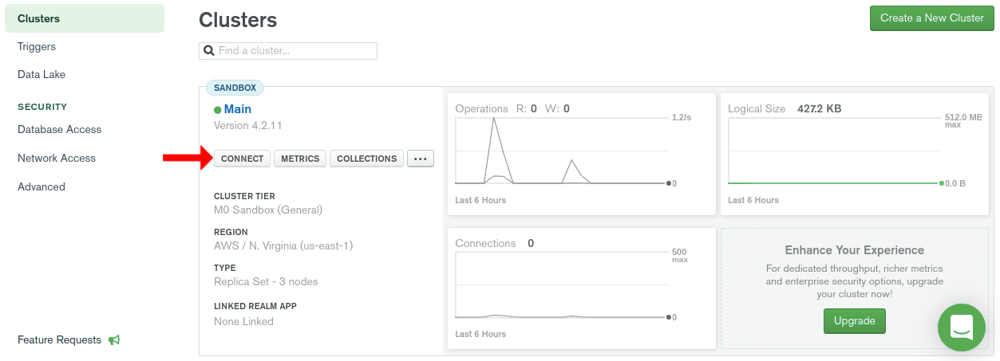
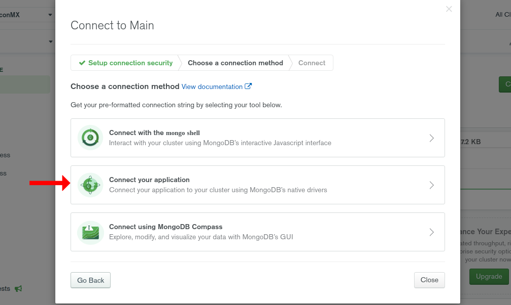
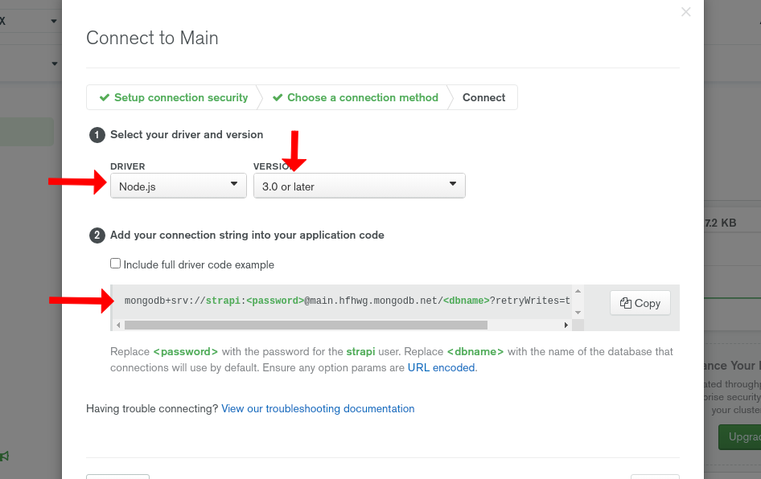

<p align="center">
  
</p>
<br><br>

<p align="center">
  
  
  
</p>

---

<h3 align="center">Guide to using Strapi + MongoDB Atlas + Docker + Docker Compose.</h3>
<br>
<p align="center">
  
</p>
<p align="center">
  <a href="./docs/README.es.md">Ver esta guía en español</a>
</p>

<br><br>

## Prerequisites

First we go to MongoDB Atlas, we log in and from the main menu we select a project. If you don't have a project, create one.


Then we go to the section **Database Access**.


We click on **Add New Database User**


We create a new user with the name and password. We must make sure to assign the necessary permissions to be able to read and write to the database. When finished we click on **Add User**


We return to the **Clusters** section and click on the **CONNECT** button


We select **Connect your application**


We configure the first field in **Node js** with version **3.0 or later** and copy the code provided below.


The following code will help us to configure strapi with MongoDB Atlas. Make sure to use yours, this is just an example.

```bash
mongodb+srv://strapi:<password>@main.hfhwg.mongodb.net/<dbname>?retryWrites=true&w=majority
```

The above code contains the following fields:

```bash
conection-type: mongodb+srv
host: main.hfhwg.mongodb.net
dbname: <dbname>
username: strapi
password: <password>
```

**Identify the same fields but with your code so that you can continue with the tutorial.**

For the **dbname** field, you will specify which is the database you want to connect to and for the **password** field it will be the password that you set for the user you created. **Follow the tutorial so you can see in detail how these fields are used**.

## 1 - Initialize the project

Run the following command to initialize the project. Change **my-project** to the actual name of your project.

```bash
npx create-strapi-app my-project
```

Then select the option **Custom (manual settings)**

```bash
? Choose your installation type
 Quickstart (recommended)
> Custom (manual settings)
```

Now select **mongo**

```bash
? Choose your default database client
 sqlite
 postgres
 mysql
> mongo
```

Insert the name of the database. **If it doesn't exist, a new one will be created with the name you provide.**

```bash
? Database name: strapi
```

The host is found in the code we got from MongoDB Atlas (**See the prerequisites above**). **Make sure to place yours, the following is an example.**

```bash
? Host: main.hfhwg.mongodb.net
```

We put **true** since it was indicated in the MongoDB Atlas code that the **connection-type** is **mongodb + srv**

```bash
? +srv connection: true
```

The default port in mongodb is **27017**

```bash
? Port (It will be ignored if you enable +srv): 27017
```

Now we will put the username we created in MongoDB Atlas. Make sure to use yours.

```bash
? Username: strapi
```

Then we put the password for the user that we used previously.

```bash
? Password: ****
```

Here we will only press enter since we will select the second option which is blank

```bash
? Authentication database (Maybe "admin" or blank):
```

Finally we will put **y** to enable a connection through ssl

```bash
? Enable SSL connection: y
```

Ready. We wait for the project to finish installing and we can access the following url where the strapi panel will be.

[http://localhost:1337](http://localhost:1337)

## 2 - Environment Variables

We must configure environment variables to be able to use them in docker and docker compose.

First we are going to edit the file `./config/database.js` where we will put the environment variables with their default values.

```javascript
module.exports = ({ env }) => ({
  defaultConnection: 'default',
  connections: {
    default: {
      connector: 'mongoose',
      settings: {
        host: env('DATABASE_HOST', '127.0.0.1'),
        srv: env.bool('DATABASE_SRV', false),
        port: env.int('DATABASE_PORT', 27017),
        database: env('DATABASE_NAME', 'strapi'),
        username: env('DATABASE_USERNAME', 'user'),
        password: env('DATABASE_PASSWORD', 'password'),
      },
      options: {
        authenticationDatabase: env('AUTHENTICATION_DATABASE', null),
        ssl: env.bool('DATABASE_SSL', false),
      },
    },
  },
})
```

Then in the file `./config/server.js` we remove the token that is in the variable ADMIN_JWT_SECRET. Make sure to keep it in a safe place, you will need it to authenticate. Do not lose it!.

```javascript
module.exports = ({ env }) => ({
  host: env('HOST', '0.0.0.0'),
  port: env.int('PORT', 1337),
  admin: {
    auth: {
      secret: env('ADMIN_JWT_SECRET'),
    },
  },
})
```

With this we will have the environment variables ready.

## 3 - Docker and Docker Compose

Now we will configure the file `./Dockerfile` in the root of the project with the following content.

```dockerfile
FROM node:14.15.4
COPY [".", "/usr/src/"]
WORKDIR /usr/src/
RUN npm install
CMD [ "npm", "start" ]
EXPOSE 1337
```

We also need the `.dockerignore` in the root of the project with the following content.

```
.git
.env
Dockerfile
.tmp
.cache
```

Let's test the image by building and running a container with the environment variables for production. We will use the MongoDB Atlas credentials. Check out the prerequisites above.

```bash
# shell
docker build -t my-strapi-image .
```

Replace the values with your MongoDB Atlas credentials, and put the **token** you saved earlier in ADMIN_JWT_SECRET.

```bash
# shell
docker run --name my-app -p 1337:1337 \
-e DATABASE_HOST=my-host \
-e DATABASE_SRV=true \
-e DATABASE_NAME=my-db \
-e DATABASE_USERNAME=my-username \
-e DATABASE_PASSWORD=my-pass \
-e DATABASE_SSL=true \
-e ADMIN_JWT_SECRET=token \
my-strapi-image
```

When the container finishes running, access the url: [http://localhost:1337](http://localhost:1337). If you can see and enter strapi then everything is fine.

Now stop the container and configure docker-compose.

We continue with the file `./docker-compose.yml` located at the root of the project with the following content. The only variable you will have to change is ADMIN_JWT_SECRET for the token you saved earlier.

```yml
version: '3'
services:
  strapi:
    build: .
    command: npm run develop
    environment:
      DATABASE_CLIENT: mongo
      DATABASE_NAME: strapi
      DATABASE_HOST: mongo
      DATABASE_PORT: 27017
      DATABASE_USERNAME: strapi
      DATABASE_PASSWORD: strapi
      ADMIN_JWT_SECRET: token
    volumes:
      - .:/srv/app
    ports:
      - '1337:1337'
    depends_on:
      - mongo

  mongo:
    image: mongo:4.2.11-bionic
    environment:
      MONGO_INITDB_DATABASE: strapi
      MONGO_INITDB_ROOT_USERNAME: strapi
      MONGO_INITDB_ROOT_PASSWORD: strapi
    volumes:
      - ./.tmp/data:/data/db
```

Now let's try docker compose with the following command.

```bash
docker-compose up
```

Wait for the image to build and both containers to run. When they finish access the url: [http://localhost:1337](http://localhost:1337)

With the previous files already configured we will have everything ready to work in development with docker compose and in production with the image declared in the Dockerfile.
