# Get AWS S3 credentials

The project is configured to use an AWS S3 bucket so we will go to AWS to create one and obtain the credentials for the static files such as images, videos, etc.

 

## Create the bucket

First [sign in](https://signin.aws.amazon.com/signin) to your AWS account. If you don't have one, [create it](https://portal.aws.amazon.com/billing/signup).

In the search bar enter s3 and click on the first result.

Now click on Create Bucket

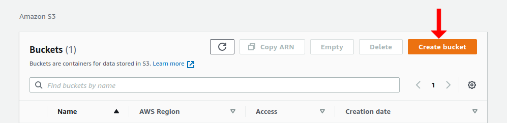

We will start to configure our bucket. The first field is to put the name of the bucket. The second is to select the region. The values ​​will depend on the needs of your project.

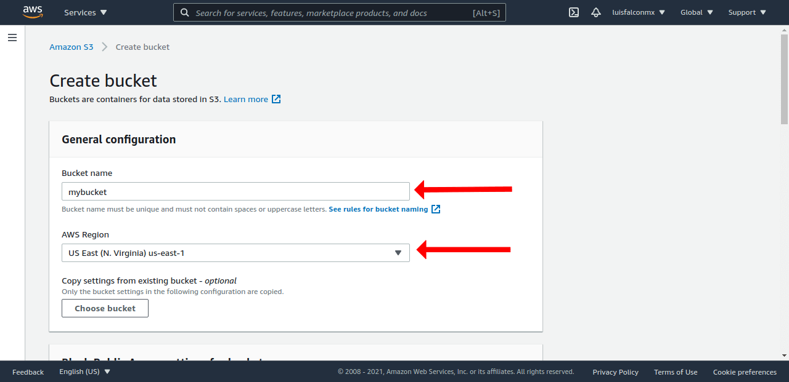

We go down to the next step and we will only select the last two options. This is important so that the public url of static files can be accessed.

Don't forget to check this box

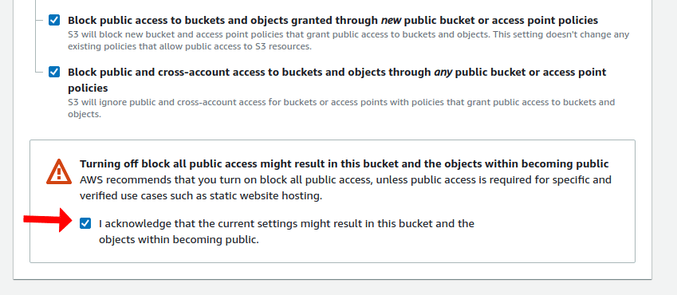

We omit the rest of the options and we are going to click on the "create a bucket" button at the bottom of the page.

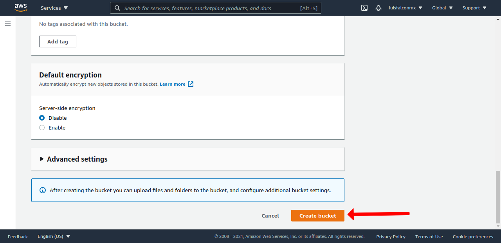

Once the bucket is created it will appear in our panel.

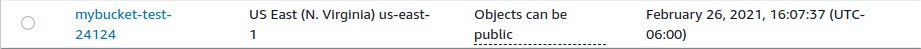

As you can see, it is showing us two values. The name of the bucket and the region.

So we have already obtained two variables:

`AWS_REGION=us-east-1`

`AWS_BUCKET=mybucket-test-24124`

Remember to put your data. The above are for example only.

 

## Create a policy in IAM

Now we will look for the IAM service so we put it in the search engine and click on the first result.

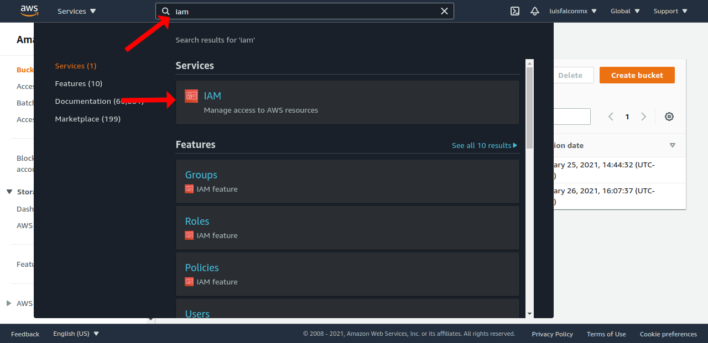

Once the panel loads we click on policies

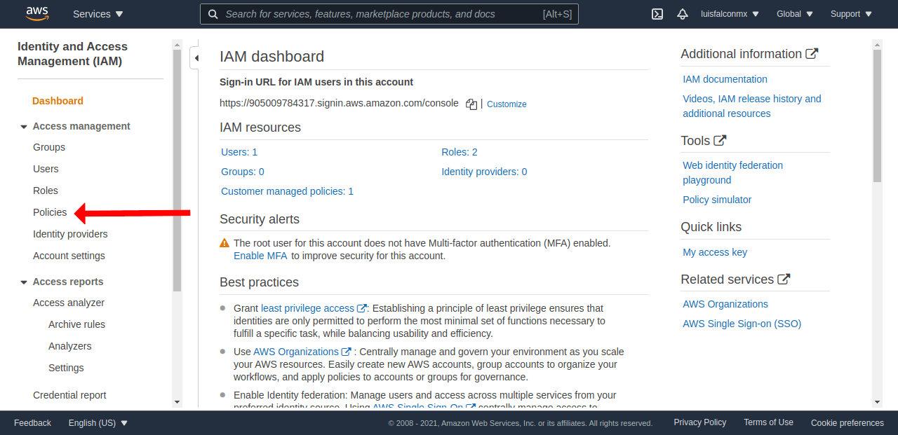

We click on the button "create policy"

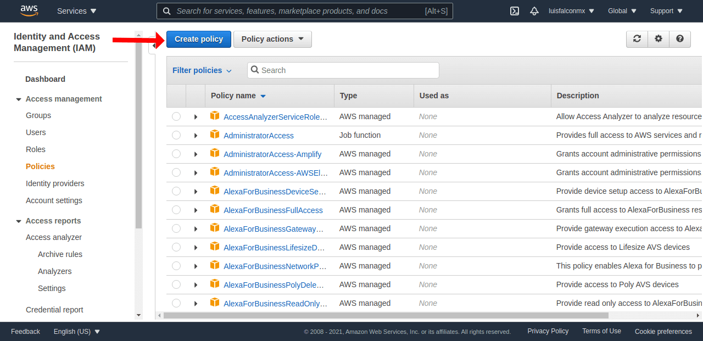

In the first option called service we will select S3

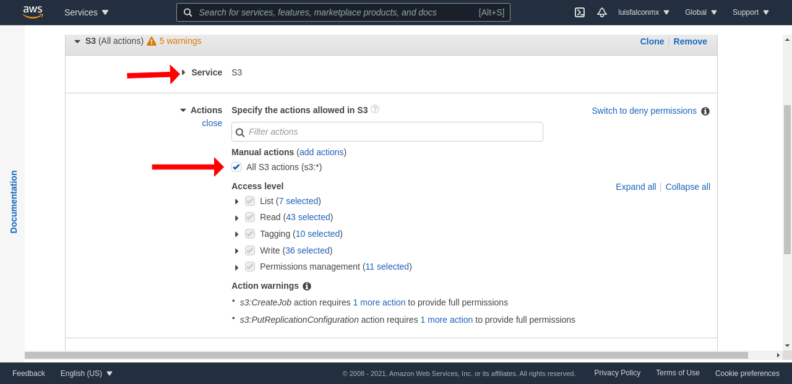

We open the resources option and select "any"

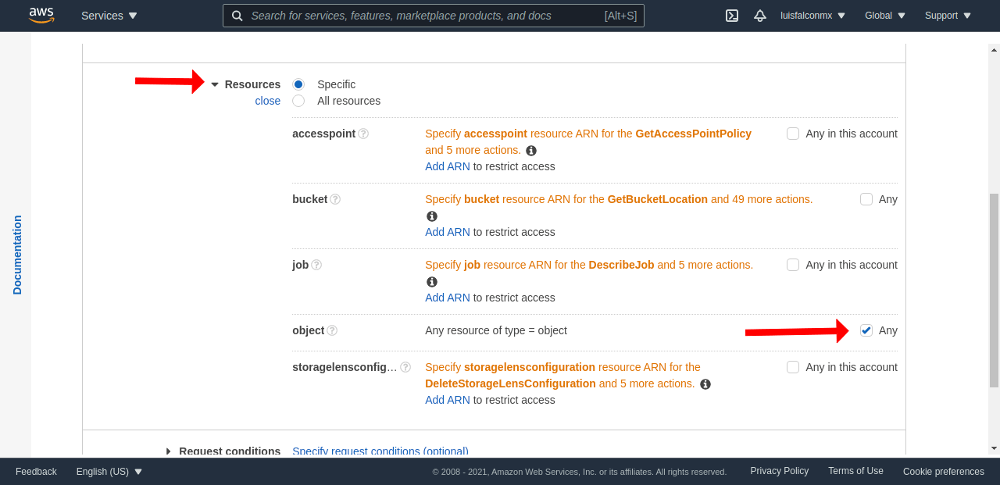

Then we click on "add ARN"

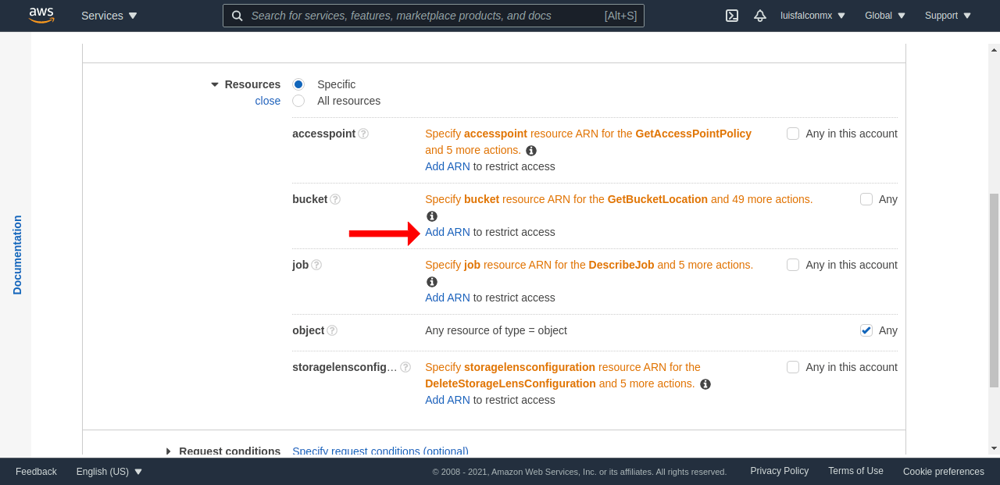

We insert the name of our bucket that we created previously and click on add

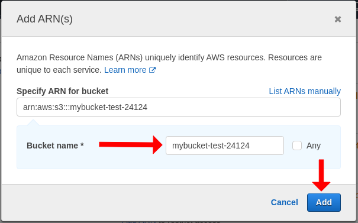

Once the RNA is added we click on the "Next: Tags" button at the bottom of the page.

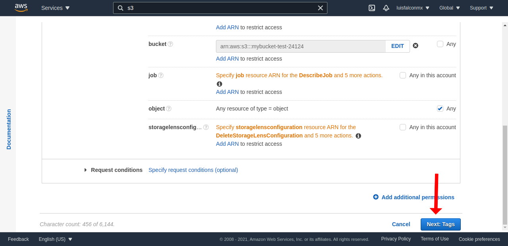

This step is optional, so we can skip unless you need to add tags to it.

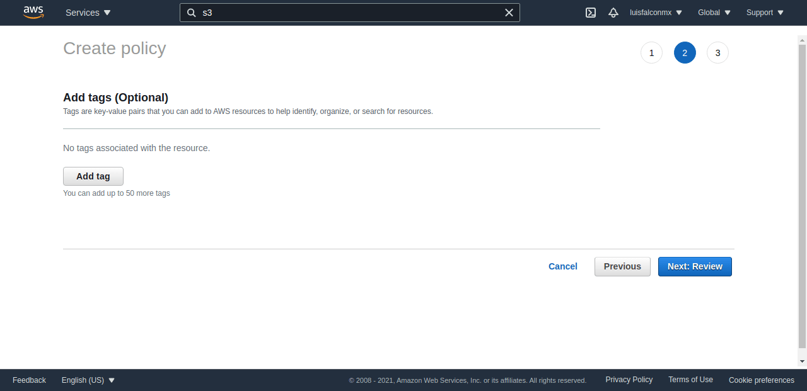

In the last step it will ask us to insert a name to the policy. I recommend that you put a name like the following: `S3BucketAccessTotal_mybucket`.

Replace `mybucket` with the name of your bucket name.

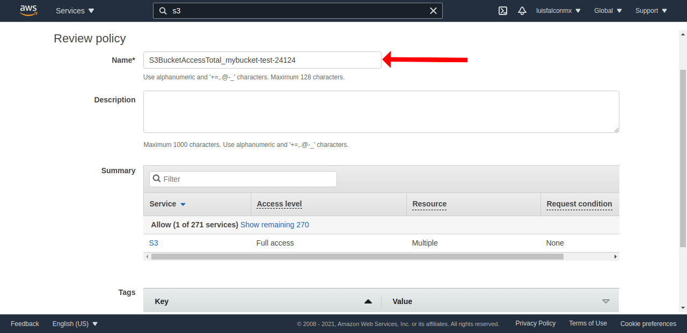

To finish we simply click on the create policy button that is at the end of the page

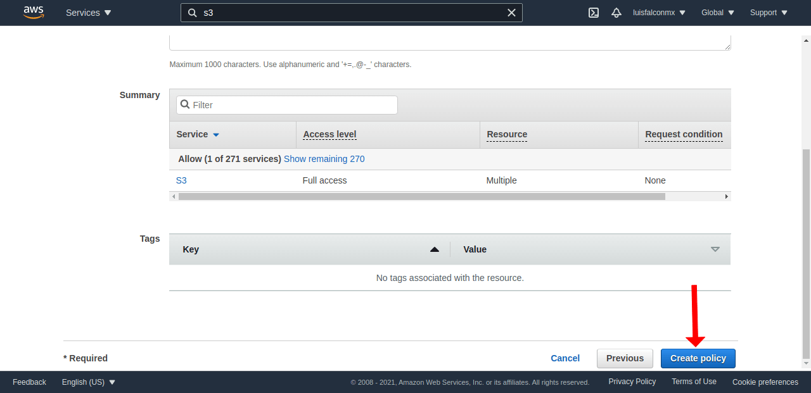

With this we will have our policy created.

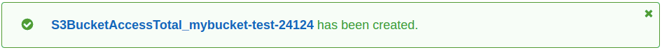

 

## Create a user in IAM

We already have the policy. Now we need to create a user to assign that policy to if we go to our IAM panel, we go to the users section and click on add user.

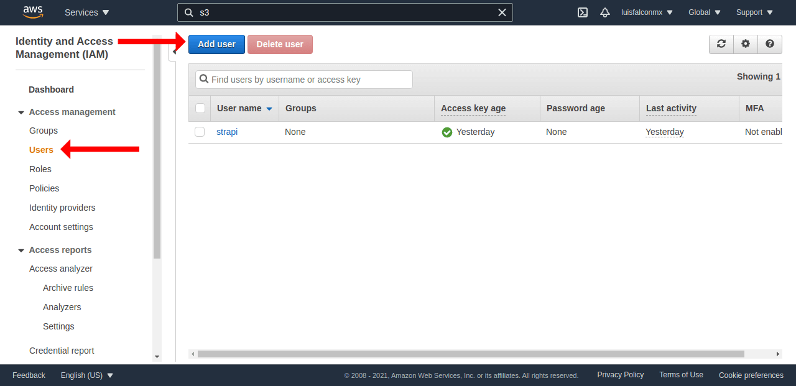

In the first field we assign a name to it. Then in Select AWS Access Type we select Programmatic Access. We click Next: Permissions

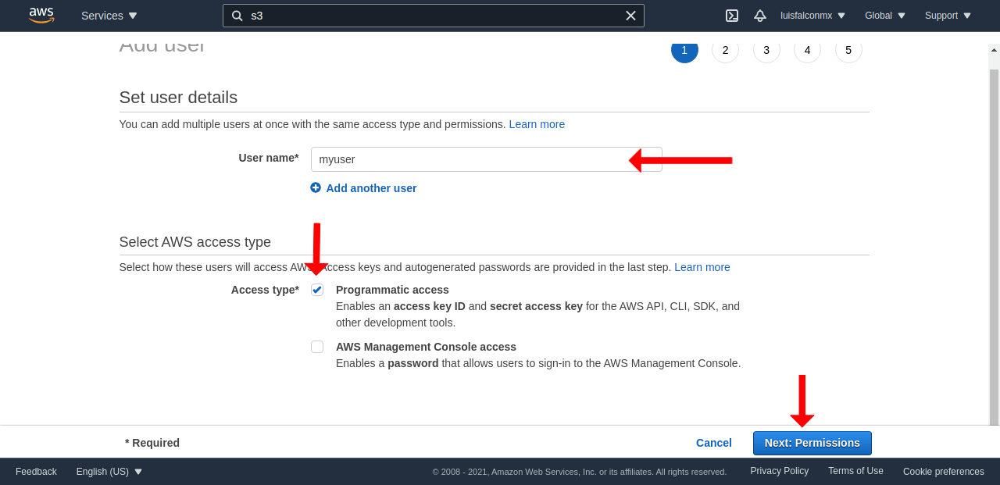

In this step we will select the option Attach Existing Policies Directly and we will look for the policy that we created. We simply check the policy box and click Next: Tags

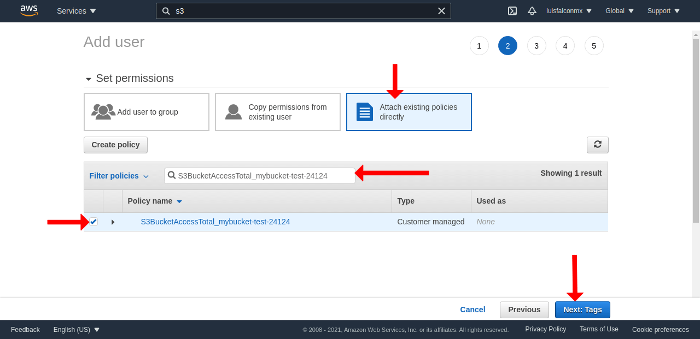

We can skip this step unless we need to add tags.

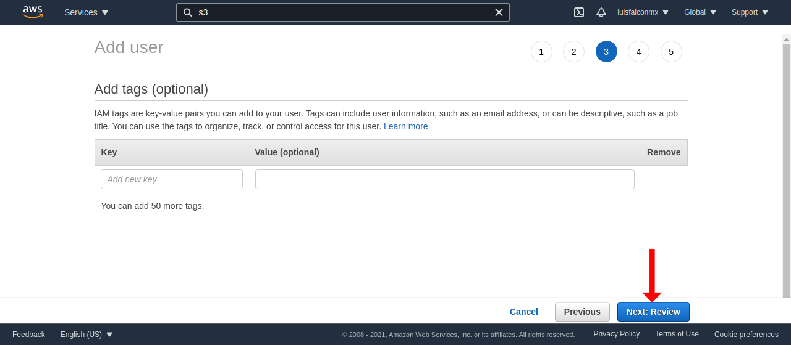

Here it will only ask us to review the configuration of the user that we are creating. If everything is correct we click on Create User.

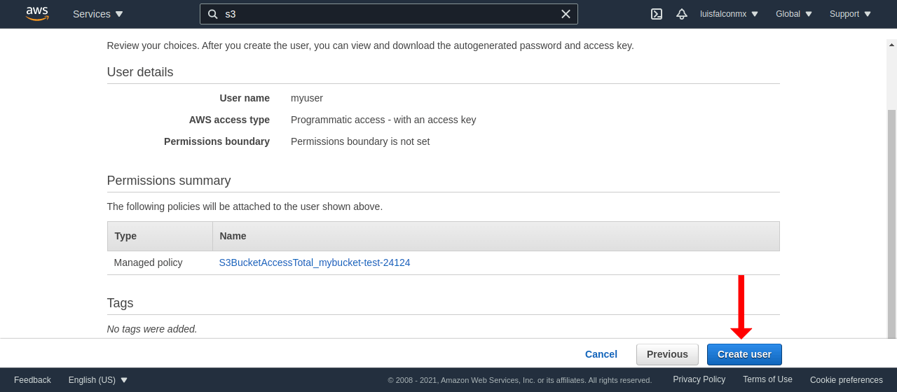

In this last step we will obtain the Access Key ID and Secret Access Key values ​​which we will place in the environment variables: `AWS_ACCESS_KEY_ID` y `AWS_ACCESS_SECRET `.

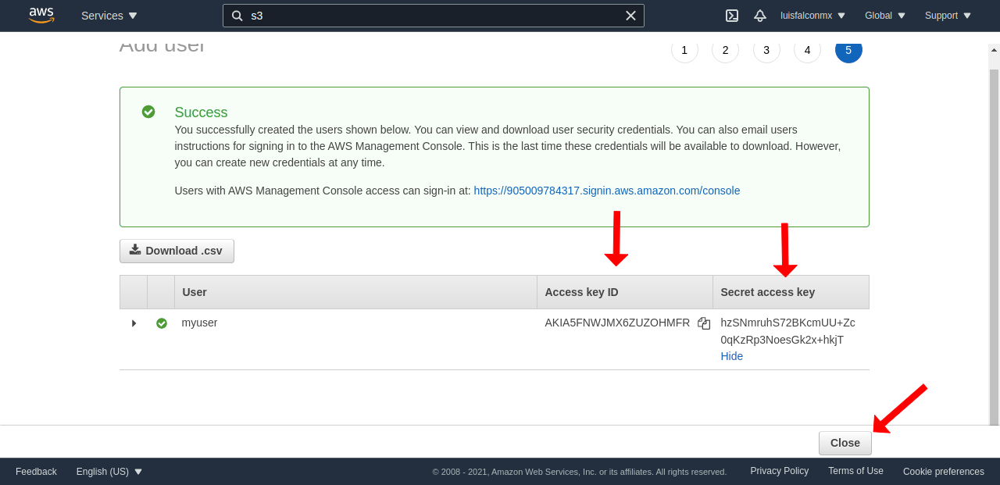

With this we already have all the environment variables that we needed to configure AWS S3.
